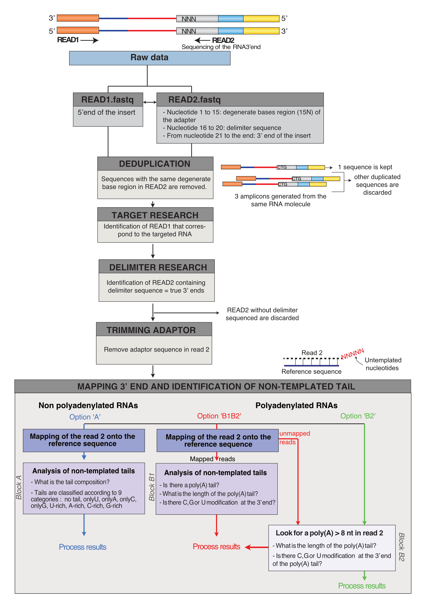
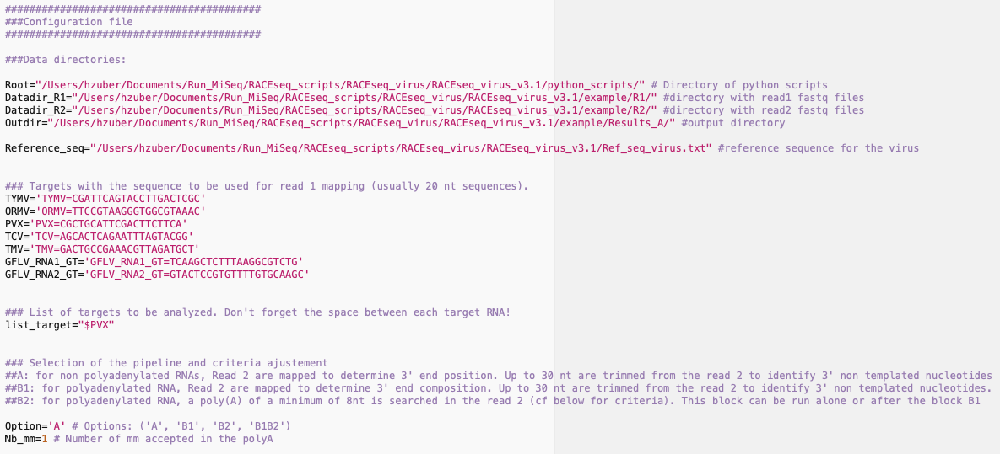
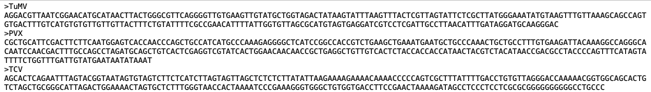
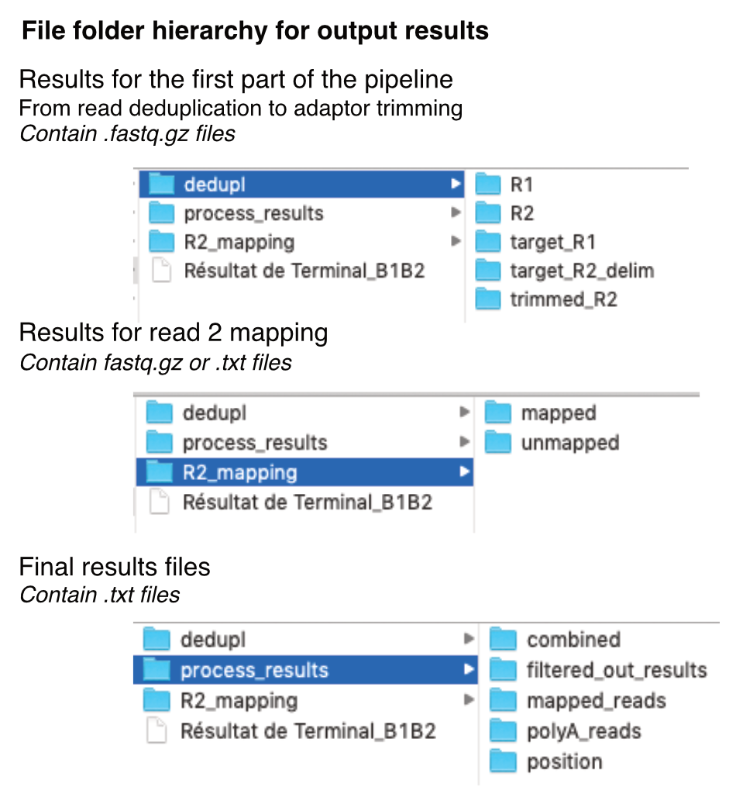

# RACEseq_virus pipeline

*RACEseq_virus_v3.4, july 2022*

***
## Overview of the pipeline

The RACEseq_virus pipeline:
  - measures polyA tail length,
  - detects other 3' untemplated nucleotides
  - maps mRNA 3' end extremity when polyA < 30As (*optional*).

Originally this pipeline was developped to analyze 5' RACEseq results. In this version, a pipeline was added to analyse 5' extremities (plus or minus strand), to detect and measure potential oligoU that is complementary to the polyA and to detect other 3' untemplated nucleotides.



There are 3 different available options for 3' RACEseq analysis:

1. **Option A** for non-polyadenylated RNAs: read 2 are mapped to determine 3' end
position. Up to 30 nt are trimmed from the read 2 to identify 3' non templated nucleotides
2. **Option B1B2** for polyadenylated RNAs: read 2 are mapped to determine 3' end
composition. Up to 30 nt are trimmed from the read 2 to identify 3' non templated nucleotides. For unmapped read 2, a poly(A) of a minimum of 8 nt is searched in the read 2.
3.  **Option B2** for polyadenylated RNAs: read 2 are not mapped (for example, when no reference sequence is available). A poly(A) of a minimum of 8 nt is searched in the read 2.

There is also a fourth option that allow analyzing 5' RACE data :

4. **Option 5RACE** to analyze 5' RACEseq results: Read 2 are mapped to determine 3' end
composition. Up to 30 nt are trimmed from the read 2 to identify 3' non templated nucleotides. For unmapped read 2, a poly(U) of a minimum of 8 nt is searched in the read 2.

***

## Dependencies
* Python 2.7 (Conversion in python 3 is in progress and will be available for the following version)
*  Python librairies:
	- [Biopython (v1.63)](http://biopython.org/wiki/Download)
	- [regex (v2.4)](https://pypi.python.org/pypi/regex)

***

## How to run the pipeline

### Preparation of the configuration file


Open the configuration file named `config.conf`and adjust:

- Data directories for python scripts, read 1 and 2 fastq files, output processed results and the file with reference sequences for read 2 mapping (provided as .fasta file, see example below).
- Nucleotidic sequence (20 nt or more) that will be searched in the read 1. One line per target.
- The list of target that will be analyzed. Each name must be preceded by a dollar sign and separated by one space
(*e.g.*```list_target="$PVX $TCV $TuMV"```).

- Selected option:
  - "A" -> for non-polyadenylated RNA
  - "B2" -> for polyadenylated RNA for which reference sequence is non available
  - "B1B2" -> for polyadenylated RNA for which reference sequence is available
  - "5RACE" -> for 5' RACEseq results
- Number of other nucleotides accepted in the poly(A) tail (*e.g.* `Nb_mm=1`).


**NB: Pay attention to mispelling errors!** Target names must be identical everywhere (including in the header of the fasta sequence of the reference file). Also, pay atention to unwanted spaces!

Example of a reference sequence file (.fasta format) :



### Launch pipeline

To run the pipeline :
- Open the terminal and go to the directory were your `config.conf` file is stored.
- Execute the script `pipeline_virus.sh` by indicating the correct path on your computer

```bash
cd Home/Documents/My_analysis/ # Where my configuration file is placed
Users/Home/Documents/RACEseq/pipeline_virus.sh # Indicate the correct path on your computer
```

- Final output files indicate for each read the target mRNA, the tail length, and the composition of potential other 3' untemplated nucleotides. These files will be placed in the `process_results/` folder of the output directory. According to the selected option, several folders can be found :
    - Folders named `mapped_reads/` and `position/`. These folders contain result files for read 2 successfully mapped onto the reference sequences. The two files are identical except that files in `position/` folder contain a supplemental column with the position of RNA 3' ends.
    - Folder named `polyA_reads/` (for 'B1B2' or 'B2' options). This folder contains result files for read 2 for which poly(A) of at least 8 nt were found.
    - Folder named `combined/` (for 'B1B2' option). This folder contains result files combining results from `mapped_reads/` and `polyA_reads/`.
    - Folder named `filtered_out_results/` where sequences lost during the last analysis step are stored.
- Import final results as data frames in R and enjoy analyzing and graph creating!


